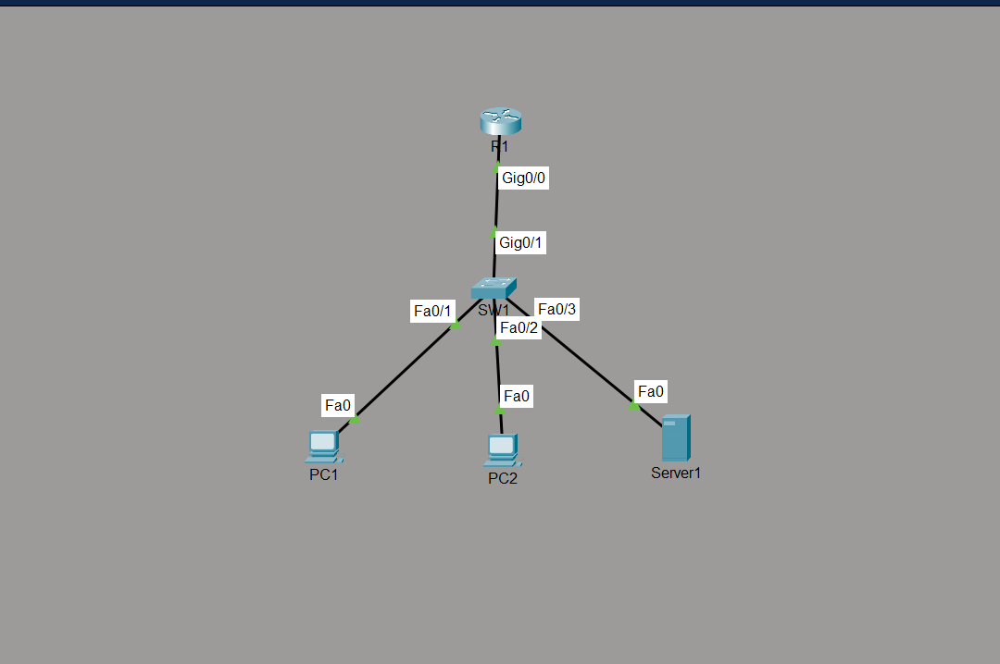

# Lab 01 — Small Business Network

## Overview

This project demonstrates the design, configuration and troubleshooting
of a small business network using Cisco Packet Tracer.

## Objectives

- Configure VLANs
- Configure trunking
- Configure inter-VLAN routing
- Configure DHCP
- Configure NAT
- Configure SSH
- Implement a basic ACL
- Test end-to-end connectivity
- Document network configuration
- Perform structured troubleshooting

## Technologies

- Cisco IOS
- Cisco Packet Tracer
- IPv4
- VLAN
- 802.1Q trunking
- Inter-VLAN routing
- DHCP
- NAT
- ACL
- SSH

## Network Devices

- 1 Cisco Router
- 1 Cisco Switch
- 2 PCs

## Topology



## Network Architecture

The network consists of:

- Cisco 2911 router — R1
- Cisco 2960 switch — SW1
- PC1
- PC2
- SERVER1

## VLAN Design

| VLAN | Name | Purpose | Network |
|---:|---|---|---|
| 10 | USERS | User devices | 192.168.10.0/24 |
| 20 | SERVERS | Server network | 192.168.20.0/24 |
| 99 | MANAGEMENT | Network management | 192.168.99.0/24 |

## IP Addressing

See the complete addressing plan:

[IP Addressing Plan](documentation/ip-addressing-plan.md)

## Technologies

- IPv4
- VLAN
- 802.1Q
- Router-on-a-stick
- DHCP
- SSH
- ACL
- Cisco IOS
- Cisco Packet Tracer

## Verification

The following Cisco commands were used:

```text
show vlan brief
show interfaces trunk
show ip interface brief
show ip route
show ip dhcp binding
show running-config
- 1 Server
## Status

In Progress
